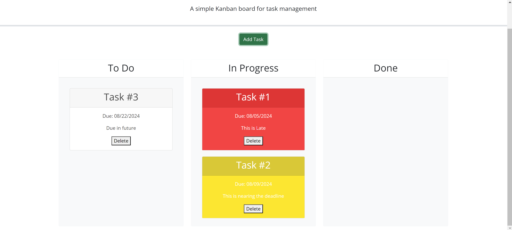

# Task-management

## Description
This is a great way to organize and visualize what you need to get done.
Task cards will automatically turn yellow or red if they are nearing or past
the deadline respectively. This allows you to identify and tackle more
urgent tasks first.

## Usage
Press the "Add Task" button to bring up the menu. 
Enter the tasks name, due date, and a description, then click add task to add it to the board.
You can drag and drop the tasks into each column to update your progress on the task.
Press Delete to remove a task.
All tasks will remain upon reloading the page.

## Website Link
https://bewtaich.github.io/Task-management/

## License
Refer to MIT License within the repository

